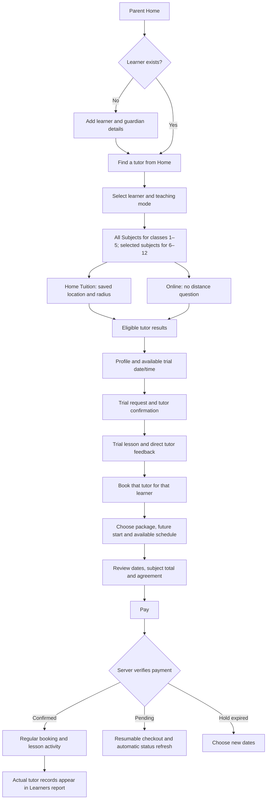

# Product Experience Blueprint

## Product promise and governing decisions

GoCoaching should help a parent choose suitable teaching, understand what was booked and see what the child actually learned. A tutor should know the next lesson, its learner/subject and the next record to complete. Staff should know which authorised queue requires an action and why. Listing tutors is the start of that service, not its whole experience.

These are proposed experience changes. Existing business rules remain authoritative:

- Add learner details once. Do not add a separate learning-needs setup.
- Parent Home owns the Find a tutor entry. Do not add it to the sidebar.
- Classes 1–5 show All Subjects for one package fee. Classes 6–12 select multiple approved subjects and multiply the staff-confirmed package fee by subject count.
- Home Tuition Weekly contains 6 classes and Monthly 24 classes. Dates follow availability and leave and can cross calendar boundaries.
- New regular classes start tomorrow or later. Parent selects classes, pays, and receives confirmation only after server-verified payment. No regular tutor acceptance step.
- Trial acceptance is a distinct existing tutor action. Tutor-submitted trial feedback is visible directly. Present regular-class progress does not await academic approval; actual disputes retain their controls.
- Tutor reports and briefs stay current-assignment scoped. Archives, corrections and handover retain their existing access rules.
- Staff sign in with passwords. Parent/tutor code sign-in, verification and recovery retain their secure email workflows.
- Updates is a one-way inbox; tuition discussion is a different, assignment-scoped feature. Neither is a general public chat.

## Proposed navigation

Keep existing URLs wherever practical. Grouping and labels are experience changes, not changes to role permissions. A hidden menu item never replaces server authorisation.

| Role | Primary daily destinations | Secondary destinations | Entry behaviour |
| --- | --- | --- | --- |
| Visitor | Home, Find tutors, How it works | Become a tutor, Support, policies, Sign in | Explain Home/Online, then collect only useful public search criteria |
| Parent | Home, Learners, Trial lessons, Regular classes | Payments, Updates, Help, Account | Home shows discovery for selected learner and relevant current activity |
| Approved tutor | Home, My learners, Trial lessons, Regular classes | Teaching hours, Earnings & payouts, Updates, Help, My application, Account | Next lesson and record/follow-up tasks first |
| Applicant | Application status, Application, Documents | Account, Help and other already permitted account routes | No approved-teaching navigation before approval |
| Administrator | Operations: applications/interviews, tutor network/follow-ups, families | Finance: payments, business/taxes. Administration: mentor accounts, reports, history, email delivery, Account. Updates/Help as authorised | Prioritised queue counts derived from authorised records |
| Mentor | Assigned assessments, interviews, tutor follow-ups and actual review/dispute work | Existing authorised tuition/help/account destinations | Assigned task queue, with historical review clearly labelled |
| Support | Cases and assigned case detail | Account and authorised operational links | Case queue with owner/status/assignment context |
| Finance | Payments and payout work | Business/taxes, authorised history, Account | Outstanding financial work and settlement state |

Desktop uses a fixed sidebar, short page header and consistent content width. Mobile keeps an accessible drawer and a compact page header. A parent/tutor destination bar is an optional research experiment, not an implementation dependency. Do not duplicate discovery navigation or place staff-only monitoring in public/parent menus.

## Parent journeys

The public discovery route does not know a private learner. It should carry only public filters and tutor intent through authentication; the parent then chooses/adds the authorised learner once. Avoid a second free-text goal, an unsupported time promise and private learner details in public search URLs.

Parent Home states:

| State | Leading content | Supporting action |
| --- | --- | --- |
| No learner | Add learner with a short explanation | Existing account/help routes |
| Learner, no teaching | Find a tutor for the selected child | Edit learner profile |
| Trial requested | Accurate requested state and next action | Find other eligible tutors if needed |
| Trial confirmed | Next trial, date, mode and available join/preparation state | Manage trial |
| Trial feedback available | Tutor feedback excerpt with source/date | Book this tutor |
| Valid unpaid checkout | Separate Complete booking notice with expiry | Resume payment; not a confirmed class |
| Active teaching | Next trial/regular lesson, clearly labelled learner/tutor/subject | Open lesson, report, Find a tutor |
| No upcoming class / package completed | Actual balance/status and latest recorded next practice | View history / eligible next booking |

Do not display every state as a permanent card. Resolve the selected learner, prioritise the nearest relevant action and show small secondary activity links.

## Tutor journeys

```mermaid
flowchart LR
    A[Application saved] --> B[Staff assessment and interview]
    B --> C[Approved scope and staff prices]
    C --> D[Teaching availability]
    D --> E[Trial request]
    E --> F[Accept or decline trial]
    F --> G[Teach trial and submit direct feedback]
    G --> H[Parent pays for regular booking]
    H --> I[Verified booking appears automatically]
    I --> J[Prepare subject and review learner brief]
    J --> K[Teach and record actual attendance/progress]
    K --> L[Parent report and next-practice guidance]
```

Home should link to the next lesson's exact class, not merely the package. The lesson surface should show current learner context, approved/booked subjects, preparation/Zoom state where eligible, teaching brief and the relevant record action. Separate planning from recorded achievement. Use actual overdue record tasks rather than generic productivity scores.

Future subject planning, structured present-progress and the seven-day correction window already exist. Improve their hierarchy; do not redesign them as new approval workflows. Tutor earnings should answer net/pending/paid first, then offer the saved breakdown. Completed archives must never expose new guardian details or restore operational access after handover.

## Staff journeys

Applications move through existing server-controlled assessment/interview/review/scope and price decisions. The review surface should present identity, approved/requested scope, evidence, document availability, decision history and required reason near the decision action. Keep personal data limited to authorised staff. Approvals must remain explicit, never implied by registration or attractive badges.

Daily operations should start from an actionable queue: assignment, scheduled interview, follow-up, actual dispute or case. A metric should link to the records that constitute it. Mentor accounts need a named action confirmation and real reason; finance mutations require existing provider/release controls. Email monitoring should show queue/accepted/rejected/uncertain state accurately and route uncertain delivery to the existing guarded decision, not a blind Retry all button.

## State and interaction model

| Situation | Experience rule |
| --- | --- |
| Loading | Preserve page identity and filter context; show a bounded skeleton/status for the pending section |
| First use | Explain the next useful action; avoid empty charts and zero-score judgements |
| No matching result | Restate actual active filters, offer deliberate widening, never silently broaden eligibility |
| Query failure | Show a visible reason at the appropriate level and Retry; keep entered filters and previous saved records where safe |
| Form validation | Inline field error and summary focus after submit; do not erase valid entries |
| Stale version / scope | Explain the specific changed selection and require a deliberate refresh/reselection |
| Payment awaiting verification | Keep checkout separate, refresh server status, show support path; no client callback success claim |
| Expired hold | Explicitly request new dates; do not reuse released reservations |
| Saved | Confirm the actual server-persisted action near its controls; retain audit history |
| Consequential action | Name the affected record/account, outcome and required reason before mutation |
| Missing academic evidence | Say Not recorded; never compute a learning score from absence of data |

Keep URL state for learner/filter/tab/date so reload/back links make sense. Use readable date/time in IST and stable opaque identifiers, not learner names or contact information, in private URLs. Do not use localStorage for learner records, credentials or session secrets.

## Visual and content principles

Use the current paper/ink/sage palette, bright surfaces and restrained highlights. The next action needs stronger hierarchy than decorative cards. Keep one primary task action per section; put secondary links nearby. Prefer plain English: Trial requested, Payment being verified, 6 classes, Tutor feedback, Not recorded. Do not advertise availability, ratings, achievements or delivery success without evidence.

Retain the current AI hero label and real database-backed tutors. Use no invented testimonials or outcome statistics. Improve mobile composition before adding decoration: compact summaries, progressive filters, next lesson above historical detail and readable prices with subject multipliers.

## Measurement plan

| Outcome | Baseline needed | Collection method |
| --- | --- | --- |
| Useful tutor discovery | Searches returning tutors eligible for all chosen criteria | Aggregated search/result counts with filter categories, no names/addresses |
| Search-to-trial request | Eligible result/profile views leading to a persisted trial request | Server-confirmed events with deduplicated anonymous/session context under an operator-approved analytics policy |
| Registration completion | Started vs successful parent/tutor signup | Count outcomes and validation categories; exclude credentials/codes |
| Tutor onboarding completion | Started/saved/submitted/approved, with abandonment stage | Application-state counts and voluntary interviews; distinguish staff waiting from abandonment |
| Booking completion | Eligible completed trial → checkout → verified booking | Server transition timestamps/statuses; exclude provider attempt retries and expired holds from fake success |
| Frequent task time | Find next lesson, read feedback, record present class, locate payout, handle case | Moderated tests with parent/tutor/staff participants; record median and observed failure paths |
| Navigation errors | Wrong destination, repeated selection, backtracking | Task observation plus privacy-reviewed aggregate route events |
| Mobile usability | Completion on realistic small screens/network conditions | Device testing, keyboard/zoom and participant observation |
| Accessibility | Automated findings and manual journey failures | Axe plus keyboard, screen reader and reflow review; no certification from automation alone |
| Ease of use | Task-specific user rating and stated confusion | Short voluntary post-task survey and interviews |

Current customer baselines are unknown. Establish them before committing to numeric improvement targets. The roadmap's first acceptance gates concern correct observable behaviour; conversion claims require subsequent genuine usage data.
